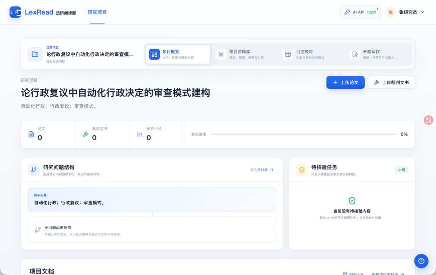
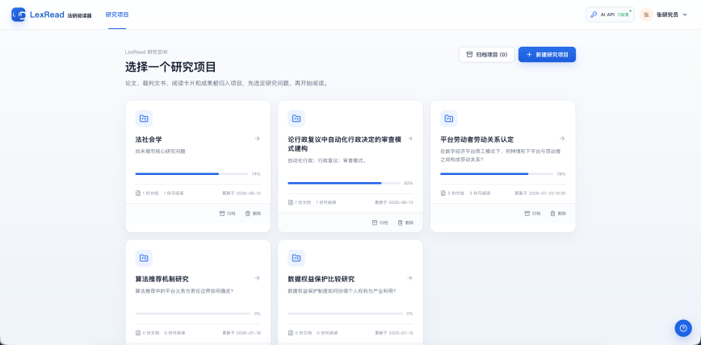
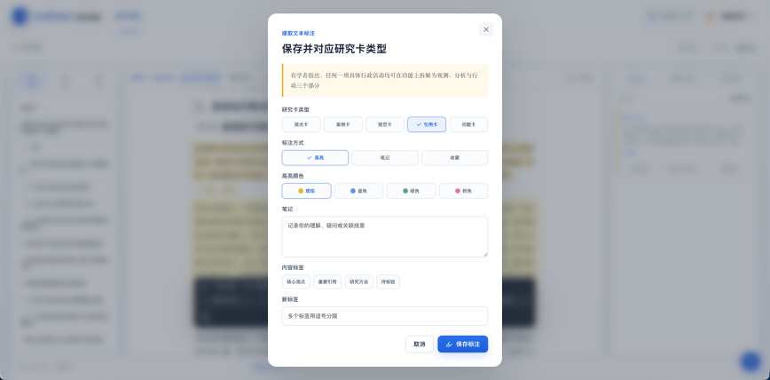
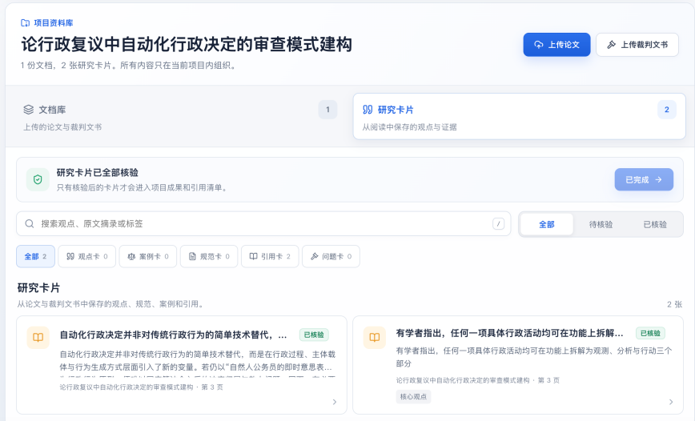
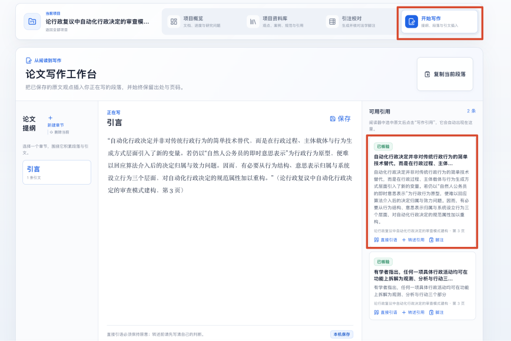

# LexRead

> 面向法学研究者的本地优先智能阅读工作台，让每一个研究判断都能回到原文。

**从检索结果到可核验的研究成果，LexRead 把论文、裁判文书、研究卡片与写作草稿放进同一条可追溯的工作流。**

[在线体验演示版](https://ovendo.github.io/LexRead-Legal-Paper-Reader/) · [下载完整版](https://github.com/ovendo/LexRead-Legal-Paper-Reader/archive/refs/heads/main.zip)

`React` · `TypeScript` · `Vite` · `Express` · `PDF.js` · `Local-first`



## 为什么做 LexRead

法律检索解决了“找到材料”的问题，却没有自动解决检索之后的研究工作：长文阅读、观点提取、来源核验、案例比较以及写作回查。当文献、笔记和草稿分散在不同工具中，最容易丢失的不是文字，而是“这个判断从哪里来”。

LexRead 因此坚持三个原则：

| 原则 | 含义 |
| --- | --- |
| **原文可溯源** | 观点、案例、规范和引用卡片保留页码、上下文与原文锚点 |
| **推理可校正** | AI 的概括与判断可以逐节点核验，不把生成结果当作不可质疑的答案 |
| **成果可复用** | 阅读产生的研究卡片直接进入项目资料库和写作工作台 |

## 核心工作流

```text
创建研究项目
    ↓
上传论文 / 裁判文书
    ↓
PDF 文字层解析 + 低置信页 OCR
    ↓
论文论证 / 裁判说理结构化分析
    ↓
回到原文逐节点核验
    ↓
保存研究卡片
    ↓
项目资料库 → 写作回查
```

LexRead 不替代专业法律数据库，而是专注于承接检索后的研究环节。所有文档、卡片和分析都归属于明确的研究项目，避免跨项目混用材料。

## 功能亮点

| 模块 | 能力 |
| --- | --- |
| **研究项目** | 统一组织论文、裁判文书、研究问题、卡片与进度 |
| **PDF 解析** | 读取原生文字层，检测异常字形，校对书签与目录 |
| **Vision OCR** | 仅对低置信页面进行 OCR，保留模型、用量、置信度、坐标与警告 |
| **论文阅读** | 提取核心问题、作者结论、适用边界和论证路径，并可跳回原页 |
| **裁判分析** | 区分当事人主张、法院认定事实、证据、规范、说理与结论 |
| **研究卡片** | 将观点、案例、规范和引用保存为带完整来源的可复用材料 |
| **项目资料库** | 按类型、状态和标签组织卡片，支持待核验与已核验流程 |
| **写作工作台** | 草稿与可用引用同屏展示，边写作边回查原文 |

## 界面预览

### 1. 从研究项目开始

每个项目是文档、研究问题、卡片和写作成果的独立容器。



### 2. 查看项目全局

在项目概览中集中查看文档、裁判文书、研究卡片和待核验任务。


### 3. 把阅读判断保存为研究卡片

卡片同时保留类型、状态、置信度、内容标签与来源信息。



### 4. 在项目资料库中核验与复用

只有完成核验的卡片才进入项目成果和引用清单。



### 5. 让写作与来源保持连接

草稿右侧直接展示可用引用，便于插入、回顾和再次核验。



## 快速开始

### macOS 一键启动

双击项目根目录中的 `LexRead 一键启动.command`。启动器会自动检查依赖、复用已运行的服务或选择可用端口，并打开浏览器。关闭启动器终端窗口即可停止本次服务。

### 终端启动

需要 Node.js 18 或更高版本。

```bash
git clone https://github.com/ovendo/LexRead-Legal-Paper-Reader.git
cd LexRead-Legal-Paper-Reader
npm install
npm run dev
```

## AI 配置

复制示例环境文件：

```bash
cp .env.local.example .env.local
```

在 `.env.local` 中填写本机密钥：

```bash
KIMI_API_KEY=在这里粘贴新密钥
KIMI_MODEL=kimi-k2.6
KIMI_OCR_MODEL=moonshot-v1-8k-vision-preview
KIMI_BASE_URL=https://api.moonshot.cn/v1
```

也可以在网页顶栏的“AI API”入口中完成设置和连接测试。网页设置保存在本机 `data/local-settings.json`，手工 `.env.local` 配置仍然兼容。

## 数据与隐私

LexRead 采用本地优先的数据策略：

- 上传的原文件、解析页、文本块、目录修改、分析任务和结果保存在本机 `data/` 目录。
- 阅读交互状态保存在浏览器本地存储中。
- `.env.local`、`data/`、构建产物和本地依赖均已排除在 Git 之外。
- 执行 OCR 时，本机只将指定的低置信页面渲染为临时图像并发送给已配置的模型，不会上传整本原 PDF。
- API 密钥只供本地后端读取，不进入前端构建、浏览器存储或 Git。

> 如果密钥曾出现在聊天记录、截图或其他非密密管理工具中，请及时在模型服务商控制台轮换。

## 开发与检查

```bash
npm run typecheck
npm run check:judgment
npm run build
```

| 路径 | 说明 |
| --- | --- |
| `src/pages/` | 核心业务页面 |
| `src/components/` | 应用框架、导航与通用交互组件 |
| `src/api.ts` | 前端与本地 API 之间的类型安全边界 |
| `src/store.tsx` | 项目、文档、阅读节点和研究卡片的共享状态 |
| `server/` | 本地 API、PDF 解析、OCR、结构化分析与 JSON 持久化 |
| `scripts/` | 本地启动、分析管线检查和文档生成脚本 |
| `lexread-promo/` | 使用 Remotion 制作的项目展示视频 |

## 项目状态

当前版本是一个可本地运行的 MVP，已打通“研究项目 → 文档上传 → PDF 解析 / OCR → 论文或裁判分析 → 原文核验 → 研究卡片 → 资料库 / 写作”的完整纵向切片。

账户系统、多用户权限与云端部署尚未纳入当前版本。LexRead 的定位是研究辅助工具，AI 生成内容应回到原文与权威法律来源中进行人工核验。
