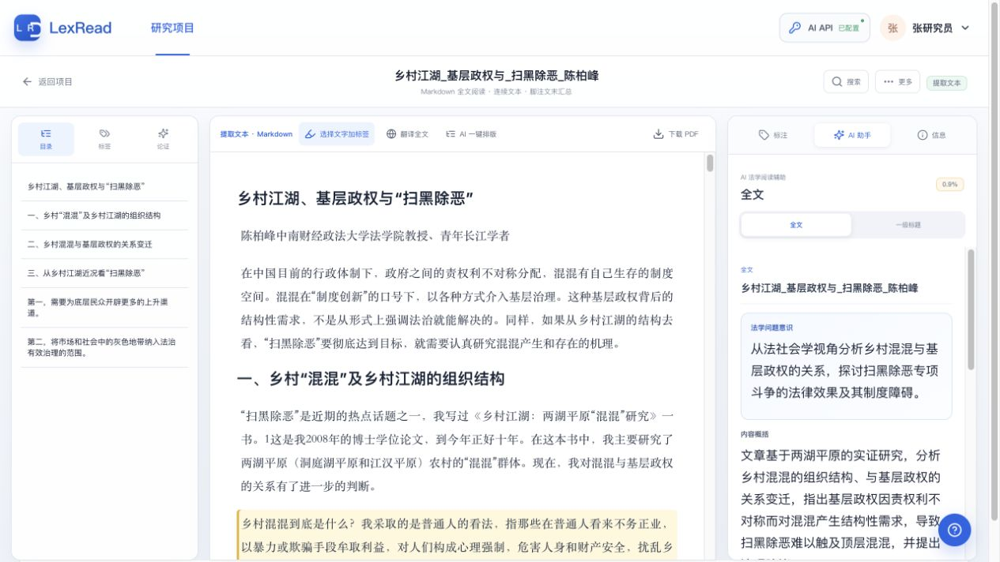

# 《法律检索》课程作业：LexRead 法学智能阅读与研究检索工作台产品需求文档

> 课程名称：法律检索（请提交前补充）  
> 任课教师：__________　姓名：__________　学号：__________　提交日期：2026 年 __ 月 __ 日  
> 文档版本：V4.1　产品阶段：本地单用户 MVP 已实现，课程作业方案完善版

## 摘要

法律检索的目标不应止于“找到一份资料”，而应形成从研究问题、检索路径、原始文献阅读、证据摘录到写作引用的可复核链条。LexRead 是一款面向法学学习者和研究者的本地研究工作台，现已实现 PDF 论文与裁判文书的导入、文本解析、按需 OCR、原文标注、研究卡片、脚注转换、写作引用和项目成果导出。产品以“原文可追溯、检索过程可说明、研究判断可校正”为设计原则。

本 PRD 在核对现有前后端实现的基础上，区分已实现功能、近期迭代与概念方案；同时补足法律检索课程作业所需要的需求分析、检索方法设计、功能规格、数据规则、风险控制、测试方案和开发计划。核心结论是：LexRead 不应把大模型定位为替代法律研究判断的“答案生成器”，而应定位为围绕用户选定材料提供 OCR、解释、结构化与比较建议的辅助工具。

**关键词：**法律检索；法学研究；裁判文书；原文溯源；研究卡片；人工智能辅助

---

## 一、项目背景与问题定义

### 1.1 课程问题意识

法律检索课程训练的不是机械输入关键词，而是围绕法律问题选择资料类型、构建检索式、判断来源权威性、核验版本与效力，并将检索所得材料转化为可用于论证的证据。以课程论文为例，学生经常经历如下断裂：

1. 在多个数据库、网页和本地文件夹中找到论文、规范或裁判文书；
2. 阅读时用高亮和零散笔记记录信息；
3. 写作时找不到原页、混淆作者观点与自己的评价，或遗漏反对材料；
4. 最后才发现引注字段不全、页码不准，难以说明材料的来源和检索过程。

LexRead 解决的是其中的“**检索结果进入研究后的管理与再利用**”问题。它不代替权威法律数据库，而是承接经合法渠道获取的 PDF、裁判文书和用户记录，使研究结论能沿“写作段落 → 研究卡片 → 标注 → 原文页码”反向追溯。

### 1.2 现有痛点

| 痛点 | 常见表现 | 对研究质量的影响 | LexRead 的应对 |
| --- | --- | --- | --- |
| 检索材料碎片化 | 文件散落在下载目录、微信、浏览器与不同数据库 | 无法按课题统一管理，重复下载、重复阅读 | 以“项目”为材料一级容器 |
| 原文定位丢失 | 只保留截图或摘录，未记录页码与上下文 | 不能核验、难以准确引注 | 标注绑定页码、文本块、偏移与上下文 |
| AI 结论不可审计 | 直接引用模型总结，未区分原文与推断 | 误读作者立场、形成无依据结论 | AI 输出必须带范围、锚点和风险提示 |
| 脚注整理成本高 | 手动转写作者、刊名、页码、案号 | 格式错误、字段遗漏 | 识别脚注并生成“待核对”的引注草稿 |
| 写作与阅读脱节 | 写作时重新翻 PDF、复制粘贴 | 引用不完整，反对材料被忽略 | 卡片、章节、立场与写作草稿关联 |

### 1.3 产品机会与边界

本产品适合做成“研究过程层”，连接外部权威检索渠道和用户的论文写作环境。其边界必须明确：

- **不替代**北大法宝、威科先行、无讼、人民法院案例库、国家法律法规数据库、知网等权威或专业数据源；后续如接入，须基于授权与来源标识。
- **不承诺**自动判断法条是否现行有效、裁判是否具有指导性、观点是否正确；这些均须有可靠数据源与人工核验。
- **不生成**可直接提交的整篇论文；AI 只能对用户指定的原文范围提供辅助性产物。
- **不上传**完整原始 PDF 到第三方模型服务；仅在用户明确启动 OCR 或 AI 问答时发送必要的页面图片或选区文本。

---

## 二、产品概述

### 2.1 产品定位

**一句话定义：**LexRead 是一个以原文为中心、服务法律检索成果管理与法学写作的本地智能阅读工作台。

**价值主张：**让用户不仅“找到并读过”材料，还能清楚说明“材料从何而来、原文在何处、为何用于此处论证、是否经过核验”。

### 2.2 目标用户

| 用户 | 主要任务 | 核心需求 | 当前优先级 |
| --- | --- | --- | --- |
| 法学本科生/研究生 | 写课程论文、学位论文、案例评析 | 快速整理文献、准确引注、避免丢失原文 | 高 |
| 教师/科研助理 | 围绕课题比较多篇论文与裁判 | 观点聚合、证据回链、发现材料缺口 | 高 |
| 律师/法务研究人员 | 阅读裁判、规则与业务材料 | 区分事实、规范、理由与结论 | 中 |
| 法律检索课程教师 | 指导检索与写作训练 | 观察学生的检索路径和引用可核验性 | 后续探索 |

### 2.3 使用场景

**场景 A：课程论文文献阅读。** 学生围绕“平台用工中劳动关系认定标准”从数据库下载论文 PDF，建立项目后上传；在阅读中对“人格从属性”“经济从属性”等段落做标签和笔记，形成观点卡；写作时选择“支持/反对/条件性”并插入带页码的引文。

**场景 B：裁判文书分析。** 用户导入裁判文书，系统将当事人主张、法院认定事实、证据、法律依据、说理和结论拆分为可回到原文的节点；用户把关键事实和裁判理由保存为案例卡。

**场景 C：检索过程留痕（规划）。** 用户记录检索平台、检索日期、检索式、筛选条件、收录结果与排除理由，将下载文献或链接关联至研究问题。该能力是法律检索课程场景的关键补强，列为 P1。

### 2.4 关键成功指标

| 指标 | 定义 | 目标值（稳定版本） |
| --- | --- | --- |
| 原文回链成功率 | 从卡片/引注跳转到正确文档与页码的比例 | ≥ 98% |
| 有锚点材料占比 | 含文档、页码和文本锚点的卡片占比 | ≥ 95% |
| 阅读沉淀率 | 每篇完成阅读文档产生的标注或卡片数 | ≥ 3 条 |
| 写作引用效率 | 打开项目至插入一条含页码引文的中位时长 | ≤ 3 分钟 |
| 可降级率 | AI/OCR 未配置或失败时仍能完成阅读与标注的比例 | 100% |

---

## 三、研究方法与检索流程设计

### 3.1 法律检索的资料层级

为避免将不同效力和用途的材料混为一谈，LexRead 将材料在研究层面区分如下：

| 层级 | 材料示例 | 研究用途 | 系统处理原则 |
| --- | --- | --- | --- |
| 规范性资料 | 法律、行政法规、司法解释、部门规章、地方规范 | 规范依据与效力判断 | 保存来源、版本/发布日期、条文定位；有效性须外部权威源核验 |
| 裁判资料 | 裁判文书、指导性案例、典型案例 | 事实、裁判规则、说理路径 | 区分法院认定与当事人主张，保留案号/法院/日期 |
| 学理资料 | 期刊论文、专著、学位论文、报告 | 理论脉络、观点支持或批评 | 保留作者、出处、页码、作者立场与适用边界 |
| 辅助资料 | 新闻、网页、课堂材料、研究笔记 | 线索或背景 | 明确非权威性，不与规范依据等同 |

### 3.2 标准检索工作流（P1 设计）

```text
界定法律问题
  → 拆分概念、主体、行为、时间和地域
  → 形成同义词、近义词、上位词/下位词与排除词
  → 选择资料库和资料类型
  → 构建检索式并记录筛选条件
  → 筛选、去重、评估权威性与时效性
  → 导入 LexRead 阅读与标注
  → 形成可回链卡片、引注与写作材料
```

**检索式记录示例：**

| 字段 | 示例 |
| --- | --- |
| 研究问题 | 平台骑手是否构成劳动关系，以及从属性如何认定？ |
| 检索库 | 中国知网/国家法律法规数据库/人民法院案例库（由用户选择） |
| 检索式 | （平台用工 OR 网约配送） AND （劳动关系 OR 从属性） |
| 限定条件 | 2019—2026 年；法学类；核心期刊优先；裁判地域为中国大陆 |
| 排除理由 | 无全文、与劳动法主题无关、重复版本、缺少可核验来源 |

### 3.3 来源评价规则

产品应提示用户，但不替代其判断。建议提供“来源评价清单”：权威性、原始性、时效性、相关性、完整性、可复核性六项。对法规、司法解释、裁判、学术论文和二次转载资料采用不同提示语，防止“搜索排名靠前”等同于“法律上可靠”。

---

## 四、现有产品基线（经代码核对）

### 4.1 已实现功能清单

| 功能模块 | 已实现能力 | 用户价值 |
| --- | --- | --- |
| 项目管理 | 项目承载研究问题、文档、卡片、提纲和草稿 | 防止跨课题材料混用 |
| 文档导入 | 本地 PDF 上传，区分论文与裁判文书 | 接住外部检索得到的材料 |
| 解析与 OCR | 文字层提取、低置信页识别、按页或全文 OCR、任务进度 | 扩大扫描件可读范围 |
| 论文阅读 | 连续提取文本、目录/页码跳转、全文搜索、阅读位置恢复 | 让用户无需等待 AI 即可开始读 |
| 自由标注 | 高亮、笔记、收藏、颜色、自由标签、编辑/删除、原文回跳 | 沉淀阅读过程与问题 |
| 锚点恢复 | 保存文本块、偏移、上下文和页码；更新后尝试恢复 | 降低 OCR/解析变化导致的标注丢失 |
| AI 辅助 | 选区问答、翻译、论文论证辅助、裁判结构化分析 | 降低理解和结构整理成本 |
| 研究卡片 | 观点、案例、规范、引用、问题五类卡片及核验状态 | 让阅读材料进入写作准备状态 |
| 引注校对 | 识别脚注、转换法学引注草稿、提示风险、回到原页 | 减少转写错误 |
| 写作工作台 | 章节草稿、直接引语/转述插入、带页码脚注草稿复制 | 打通阅读与写作 |
| 成果导出 | 汇总已分析文档和已核验卡片，导出 Markdown | 输出阶段性研究成果 |

### 4.2 当前实现的限制

1. 阅读器当前以连续提取文本为主；虽然服务端可以提供原 PDF 页面图像，但尚未完成稳定的“原页—文本”双栏同步体验。
2. 项目标签的重命名、合并、删除已有服务端能力，前端尚未形成完整管理界面。
3. 跨论文观点矩阵已有数据模型与页面雏形，但当前正式导航展示的是“引注校对”，矩阵未作为可交付功能开放。
4. 目前不直接连接外部法律数据库，因此不具备法规有效性校验、案例状态校验和一站式在线检索能力。
5. 本地数据采用 JSON 持久化与浏览器状态协同保存，仍需补充备份、恢复、迁移和删除回收站。

---

## 五、信息架构与核心业务流程

### 5.1 信息架构

```text
LexRead
├─ 项目概览
│  ├─ 主/子研究问题（P1）
│  ├─ 文档进度与任务
│  └─ 研究问题材料覆盖（P1）
├─ 项目资料库
│  ├─ 论文与裁判文书
│  ├─ 标注中心（P0）
│  ├─ 研究卡片
│  └─ 标签治理（P0）
├─ 引注校对
│  ├─ 原始脚注
│  ├─ 格式化草稿
│  └─ 风险与字段编辑（P1）
├─ 写作工作台
│  ├─ 提纲与章节
│  ├─ 引文插入
│  └─ 段落/脚注复制
└─ 检索日志（P1）
   ├─ 检索平台与检索式
   ├─ 筛选与排除理由
   └─ 检索结果关联
```

### 5.2 主业务流程：从检索到写作

| 阶段 | 用户动作 | 系统行为 | 输出 |
| --- | --- | --- | --- |
| 1. 建项 | 输入课题与核心问题 | 新建项目和默认提纲 | 项目空间 |
| 2. 检索 | 在授权数据库检索并记录策略（P1） | 保存平台、检索式、日期、筛选条件 | 可说明的检索日志 |
| 3. 导入 | 上传合法获取的 PDF | 解析文字层、目录和低置信页 | 可阅读文档 |
| 4. 阅读 | 翻阅、搜索、选中文本 | 保存标注、标签、笔记和位置 | 可定位阅读记录 |
| 5. 整理 | 把重要标注转为卡片 | 绑定来源、立场、核验状态与章节 | 研究材料库 |
| 6. 写作 | 插入直接引语或转述 | 附加页码和脚注草稿 | 可核验段落 |
| 7. 复核 | 点击卡片/引文回原文 | 打开文档、页码和文本锚点 | 可提交前核验 |

### 5.3 异常与降级流程

- 未配置 AI：允许导入、解析、阅读、标注、转卡、写作和导出；AI 按钮显示配置入口。
- OCR 失败：保留原文字层和已成功页，提示用户选择重试页或手工阅读原页。
- AI 分析失败：保留文档、标注和卡片，不阻塞阅读；显示可重试原因。
- 锚点失效：标记为“需修复”，保留原摘录但不得宣称精确定位或标记为已核验。
- 引注字段缺失：输出风险提示，不虚构作者、刊期、页码、案号等信息。

---

## 六、功能需求规格

### 6.1 项目与研究问题（FR-01）

**目标：**以项目隔离不同课程论文或研究课题的材料。

| 编号 | 需求 | 优先级 | 验收标准 |
| --- | --- | --- | --- |
| FR-01-01 | 新建、选择、编辑项目 | 已实现 | 项目切换后只显示该项目的文档、卡片和草稿 |
| FR-01-02 | 设置主问题和多个子问题 | P1 | 每条材料可关联至少一个问题；项目概览显示覆盖情况 |
| FR-01-03 | 记录检索策略与来源渠道 | P1 | 每条检索日志含平台、日期、检索式、筛选条件和关联问题 |
| FR-01-04 | 项目包导出/导入与备份 | P0 | 可恢复文档元数据、标注、卡片、草稿；原 PDF 可选包含 |

### 6.2 文档导入、解析与 OCR（FR-02）

| 编号 | 需求 | 优先级 | 验收标准 |
| --- | --- | --- | --- |
| FR-02-01 | 上传论文或裁判文书 PDF 并保存原文件 | 已实现 | 解析完成后可回到原文件和页码 |
| FR-02-02 | 文字层解析、页面结构与目录提取 | 已实现 | 文本可阅读、目录可跳转；无目录时正常降级 |
| FR-02-03 | 低置信页检测与按页 OCR | 已实现 | OCR 逐页显示状态；成功页可立即使用 |
| FR-02-04 | 原页与文本同步查看 | P0 | 点击标注/搜索/脚注可定位文本与原页同一页 |
| FR-02-05 | 解析版本比较与受影响标注提示 | P2 | 重新 OCR/解析后列出变化页面和可能受影响锚点 |

### 6.3 原文阅读与标注（FR-03）

| 编号 | 需求 | 优先级 | 验收标准 |
| --- | --- | --- | --- |
| FR-03-01 | 不依赖 AI 的原文阅读、目录、搜索和位置恢复 | 已实现 | 未配置 AI 时可完整阅读文字型 PDF |
| FR-03-02 | 高亮、笔记、收藏、标签和颜色 | 已实现 | 两次主要操作内完成一条带标签标注 |
| FR-03-03 | 保存多重定位信息并恢复锚点 | 已实现 | 标注至少包含文档、页码、摘录和文本定位 |
| FR-03-04 | 项目级标注中心和批量操作 | P0 | 可按文档/标签/时间/类型筛选，支持批量标签和转卡 |
| FR-03-05 | 标签重命名、合并、删除的可视化管理 | P0 | 操作前显示影响数；合并后无重复标签 |

### 6.4 AI 阅读辅助（FR-04）

**产品规则：**AI 是可选工具，默认不在进入阅读器时自动调用。所有 AI 输出以独立“AI 产物”保存，不自动写入用户标签、笔记和卡片。

| 编号 | 需求 | 优先级 | 验收标准 |
| --- | --- | --- | --- |
| FR-04-01 | 选区解释、问答与翻译 | 已实现 | 回答基于选区及有限上下文，区分原文与推断 |
| FR-04-02 | 论文论证与裁判说理辅助 | 已实现 | 输出展示来源锚点、状态与失败信息 |
| FR-04-03 | 用户主动选择选区/页/章/全文 AI 范围 | P0 | 点击阅读入口不产生第三方 AI 请求 |
| FR-04-04 | 保存模型、时间、输入范围、锚点和接受状态 | P0 | 任何 AI 结果均可追溯、编辑、忽略或删除 |
| FR-04-05 | 基于已选材料的观点比较草稿 | P1 | 输出只引用用户选定材料，并逐项列出来源 |

### 6.5 研究卡片、观点矩阵与写作（FR-05）

| 编号 | 需求 | 优先级 | 验收标准 |
| --- | --- | --- | --- |
| FR-05-01 | 五类研究卡片及原文回链 | 已实现 | 无来源锚点的卡片不得标记“已核验” |
| FR-05-02 | 按支持、反对、条件性、背景分类材料 | 已实现基础/P1 交付 | 用户可查看不同立场材料并回到来源 |
| FR-05-03 | 正式观点矩阵 | P1 | 至少支持 3 份材料横向比较，导出 Markdown/CSV |
| FR-05-04 | 提纲、段落草稿、直接引语/转述插入 | 已实现 | 插入内容携带页码和对应卡片 ID |
| FR-05-05 | 标出章节的支持材料、反对材料与缺口 | P1 | 每个章节显示材料数量及未核验/待补充提示 |

### 6.6 引注校对与法律检索日志（FR-06）

| 编号 | 需求 | 优先级 | 验收标准 |
| --- | --- | --- | --- |
| FR-06-01 | PDF 脚注识别、引注草稿、风险提示和原页回跳 | 已实现 | 缺失字段被标记，系统不虚构补全 |
| FR-06-02 | 常用法学脚注预设与字段编辑 | P1 | 输出明确为草稿，用户可修改作者、刊期、页码等字段 |
| FR-06-03 | 正文脚注标记与脚注块双向跳转 | P1 | 任意一端可跳转至另一端和原页 |
| FR-06-04 | 检索日志、结果去重与排除理由 | P1 | 可导出附录式检索记录，支撑课程作业方法说明 |

---

## 七、核心页面说明

### 7.1 项目概览页

- 展示项目标题、主问题、材料数量、处理进度、已核验卡片和待办事项。
- P1 增加“研究问题—材料覆盖”图，提示某子问题尚无规范、裁判或反对意见材料。
- 主要操作：上传论文、上传裁判文书、查看资料库、进入写作、记录检索日志。

### 7.2 论文阅读器

- 左侧：目录、页面、标签、论证结构（AI 可选）。
- 中间：P0 前为连续提取文本；P0 后可切换/并排查看原始页面。
- 右侧：当前/全文标注、AI 助手、文献信息。
- 选区浮动工具条：写作引用、高亮、标签、笔记、询问 AI、翻译。
- 底部：当前页、阅读位置、标注数量和任务状态。

### 7.3 项目资料库与标注中心

- 文档视图：类型、状态、阅读进度、卡片数、最后更新时间。
- 卡片视图：类型、核验状态、来源、页码、标签、立场、写作章节。
- P0 标注视图：按标签、文档、时间、笔记、是否转卡筛选；支持批量处理。

### 7.4 引注校对与写作页

- 引注校对页并列展示原脚注、转换草稿、缺失字段/风险、原文定位。
- 写作页左侧为章节提纲，中间为段落草稿，右侧为可用卡片；插入分为直接引语、转述和脚注三种动作。
- 明示“直接引语必须对照原文；转述应先写自己的判断；引注草稿提交前须核对”。

### 7.5 当前实现界面截图

以下截图直接取自本地运行的 LexRead 网页，用于说明本文“已实现”功能的实际界面，而非概念原型。截图中的研究项目与材料为产品内置演示数据。





---

## 八、数据模型与可追溯规则

| 实体 | 核心字段 | 规则 |
| --- | --- | --- |
| Project | 标题、主/子问题、提纲、创建/更新时间 | 项目是数据隔离边界 |
| Document | 类型、来源、作者、原 PDF、页数、解析/OCR/AI 状态 | `readable` 不依赖 AI 成功 |
| Annotation | 原文、页码、块 ID、偏移、上下文、矩形、标签、笔记 | 记录 `exact/recovered/orphaned` 锚点状态 |
| ResearchCard | 类型、摘录、释义、来源、页码、关系、核验状态 | 无可靠原文定位不得标为已核验 |
| AIArtifact（P0） | 范围、输入锚点、模型、时间、输出、接受状态 | 与用户标注/卡片分离保存 |
| Citation | 原脚注、格式化草稿、字段、风险、页码 | 仅为草稿，不自动补写事实字段 |
| SearchLog（P1） | 平台、日期、检索式、筛选、排除理由、关联问题 | 记录检索过程，不保存未经授权的数据库全文 |

**追溯链要求：**任何进入写作或项目成果的材料，至少应存在 `项目 → 文档 → 页码 → 原文摘录 → 卡片/引文 → 写作章节` 中的可访问路径。对 AI 生成内容，还应加上 `AI 输入范围 → 模型/时间 → 用户接受状态`。

---

## 九、非功能需求与法律伦理要求

### 9.1 可靠性与性能

- 基础解析成功后优先开放阅读；OCR 和 AI 使用可恢复后台任务。
- 长文搜索、标注列表和目录应采取懒加载/限量返回，避免阻塞阅读器。
- 写入采用原子化保存；P0 建立自动备份、手工导出与恢复机制。

### 9.2 隐私、数据与著作权

- API 密钥仅保存在本机配置，不回显到前端、不写入代码库。
- 对接第三方模型前告知发送范围；默认不上传整份 PDF。
- 用户仅应导入其有权访问、用于学习研究的材料；系统不提供绕过数据库访问控制、批量抓取或传播受限全文的能力。
- 导出必须由用户显式发起；诊断日志默认关闭且不得含原文、标注正文或密钥。

### 9.3 AI 使用边界

- 页面明确提示：AI 输出用于建立阅读路径和提出待验证问题，不构成法律意见、规范有效性判断或学术结论。
- AI 产物需区分“原文摘录”“作者明确主张”“模型推断”“用户判断”。
- 对无锚点或低置信内容显示醒目风险提示，不允许直接进入“已核验成果”。

---

## 十、优先级、里程碑与测试方案

### 10.1 迭代路线图

| 版本 | 时间建议 | 目标 | 主要交付 |
| --- | --- | --- | --- |
| V4.1（当前） | 已完成 | 单用户本地研究闭环 | 导入、解析、阅读、标注、卡片、引注草稿、写作、成果导出 |
| V4.2（P0） | 2—4 周 | 提升可靠性与可控性 | 原页/文本双视图、主动 AI、标注中心、标签治理、备份恢复 |
| V4.3（P1） | 4—8 周 | 回应法律检索课程需求 | 检索日志、来源评价、观点矩阵、研究问题覆盖、引注字段编辑 |
| V5.0（P2） | 视授权与资源而定 | 扩展外部知识与协作 | 权威数据源接入、语义检索、版本比较、多端协作 |

### 10.2 核心验收用例

| 编号 | 测试场景 | 预期结果 |
| --- | --- | --- |
| TC-01 | 未配置 AI，上传文字型 PDF | 可解析、阅读、搜索、标注、转卡与写作 |
| TC-02 | 上传扫描型 PDF，部分页 OCR 失败 | 已解析页正常阅读；失败页可重试且不丢失数据 |
| TC-03 | 选中一段原文，添加标签和笔记 | 两次主要操作内保存；包含页码和原文定位 |
| TC-04 | 将标注转为研究卡片并在写作页插入 | 原标注保留；插入内容带来源和页码 |
| TC-05 | 点击卡片或引注“回到原文” | 跳转到正确文档、页码和对应文本 |
| TC-06 | AI 返回无来源结论 | 显示推断提示，不能标为已核验材料 |
| TC-07 | 标签合并 | 显示影响数，替换后无重复标签，标注不丢失 |
| TC-08 | 导出项目包后重新导入（P0） | 卡片、标注、草稿和关联关系可恢复 |
| TC-09 | 记录一次检索日志（P1） | 含检索库、日期、检索式、筛选和排除理由，并能关联材料 |

### 10.3 发布门槛

- 不存在“AI 未配置即无法阅读”的阻断路径。
- 所有已核验卡片均具有可访问的原文来源和页码。
- OCR/AI 失败不会造成 PDF、解析文本、标注、卡片或草稿丢失。
- 所有外发给 AI 的操作都有明确触发、范围说明和错误反馈。
- 删除项目、文档或批量标注前显示影响范围，并有 P0 回收/恢复方案。

---

## 十一、风险分析与应对

| 风险 | 可能后果 | 应对措施 |
| --- | --- | --- |
| OCR 误识别 | 原文摘录或页码对应错误 | 保存原页；标注绑定上下文；低置信页提示与人工复核 |
| AI 幻觉或过度概括 | 误把模型推断当作者观点 | AI 产物独立保存、来源锚点、显著风险提示、人工核验门槛 |
| 数据库/格式变化 | 外部检索来源或引注格式失效 | 不把第三方页面结构写死；格式化规则配置化；保留原始脚注 |
| 本地数据损坏 | 标注、卡片和草稿丢失 | 原子写入、版本备份、项目包导出/恢复 |
| 著作权与数据合规 | 不当传播受限全文 | 仅处理用户合法导入材料；不提供绕过访问控制功能 |
| 需求膨胀 | 产品变成低质量“万能法律助手” | 坚持原文追溯、研究整理与写作辅助的核心边界 |

---

## 十二、结论

LexRead 的创新点不在于用 AI 替用户回答法律问题，而在于将法律检索成果转化为可复核的研究过程。现有 MVP 已经打通“本地材料导入—解析阅读—自由标注—研究卡片—引注草稿—写作引用”的基本链路。下一阶段最应优先完成的并非增加更多模型能力，而是完善原页与文本对照、标注中心、标签治理、数据备份和主动 AI 控制；在此基础上，再建设检索日志、来源评价和观点矩阵，才能真正契合法律检索课程所强调的检索方法、资料评价与论证可验证性。

---

## 附录 A：术语表

| 术语 | 含义 |
| --- | --- |
| 原文锚点 | 将摘录定位回文档、页码、文本块和字符位置的信息集合 |
| 研究卡片 | 将重要摘录与用户释义、用途、标签、核验状态结合的研究单元 |
| 引注草稿 | 系统依据原脚注转换的候选格式，仍需用户核对 |
| 检索日志 | 对检索库、日期、检索式、筛选条件、结果与排除理由的记录 |
| 已核验 | 用户已回到原文确认材料与定位；不代表观点在实体法上必然正确 |
| AI 产物 | 由模型基于指定范围生成的辅助性内容，不等同于用户研究结论 |

## 附录 B：提交前自检

- [ ] 填写课程名称、教师、姓名、学号和提交日期。
- [ ] 根据实际演示情况，保留“已实现”与“P0/P1/P2”的区分，不把规划功能写成已完成。
- [ ] 如课程要求附原型截图，可依次放入：项目概览、阅读器标注、引注校对、写作工作台四张截图。
- [ ] 如课程要求说明检索方法，可用第三章的检索式记录表填写一次真实检索过程作为附录。
- [ ] 最终提交前，对直接引语、页码、脚注草稿和 AI 生成内容逐项回到原文核验。
